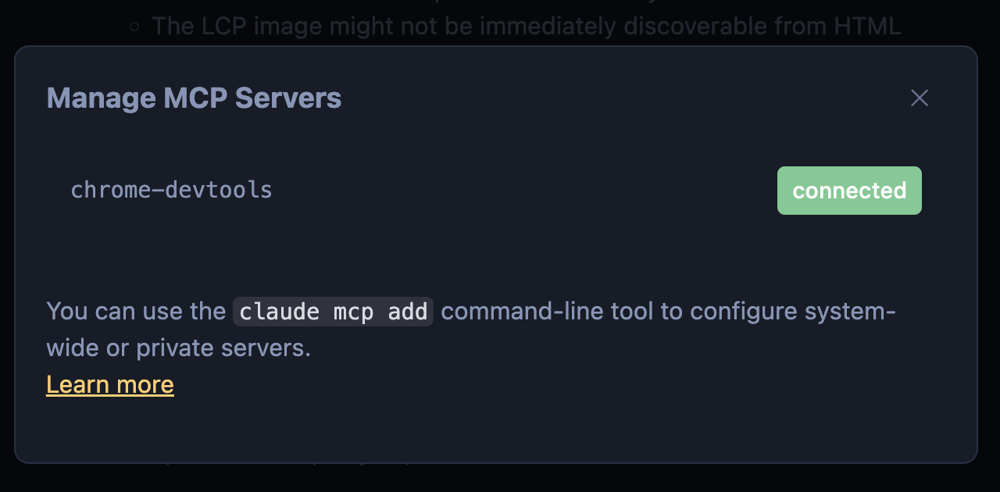

This guide covers adding a basic external Model Context Protocol (MCP) to Claude Code. 
We will add the Chrome DevTools MCP to enable Claude to check site performance.

## Prerequisites

- Claude Code configured on the terminal
- Node.js version `20.19` or higher
- Chrome Browser


---

### Step 1: Register the MCP with Claude
This command tells the Claude extension that a new context provider called chrome-devtools exists and is executed using an npx command.

1. In your terminal, run the following command:
```bash
claude mcp add chrome-devtools npx chrome-devtools-mcp@latest
```

2. Claude will register this MCP
   - You can verify the terminal installation by running this slash command in claude: `/mcp` or this command in your termina: `claude mcp list` 


### Step 2: Use the MCP in a Chat
Lets now invoke the registered MCP from the Claude chat to perform the verification task.

1. Initialize Claude Code in your terminal.
2. Type the following prompt
```
check the pagespeed performance of nfl.com
```
3. When Claude prompts you for permission to execute, please select "yes"

4. If Successful, Claude will now run a pagespeed test on nfl.com and give you an analysis of the results.

---
## Notes
- While MCP unifies tooling, it does not unify installation. MCPs may have specific installation instructions and different requirements from each other. Typically `npx` or `uv` (Python package/project manager) is utilized.
- MCPs can be a potential security risk vector. For any professional usage, please make sure you are using official or internally validated MCP servers. 
- Some MCPS to try explore next:
  - [Context7](https://github.com/upstash/context7) - Code Docs for Agents
  - [Atlassian](https://github.com/atlassian/atlassian-mcp-server?tab=readme-ov-file) - Parse and input Jira Tickets into your Agent Workflow
  - [Github](https://github.com/github/github-mcp-server) - Get Claude to open PRs for you
  - [Figma](https://developers.figma.com/docs/figma-mcp-server/) - Allows agents to read and parse your Figma files


## Further Reading


- [Official Claude MCP Documentation](https://code.claude.com/docs/en/mcp)
- [MCP Documentation](https://modelcontextprotocol.io/docs/getting-started/intro)