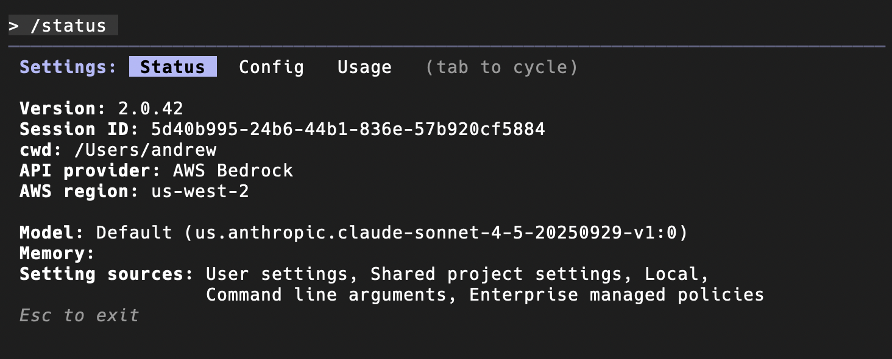

This guide shows how to configure the terminal instance of Claude Code to use your secure AWS Bedrock endpoint instead of the public Anthropic API.

## Prerequisites

- Node version `20.19` or higher
- An AWS account
- Access to Claude models (e.g., `Claude 4.5 Sonnet` ) enabled in your AWS Bedrock console
- **AWS credentials configured locally**. The simplest method is to install the AWS CLI and run `aws configure` but check with your IT/infrastructure team. Claude will automatically find these credentials once configured to use Bedrock.

---

### Step 1: Install the Claude Code for VS code Extension
1. Open your terminal
2. Run `npm install -g @anthropic-ai/claude-code`

### Step 2: Add the Bedrock Configuration to Claude Code settings.json
> ⚠️ Please validate that your AWS credentials are configured before proceeding ⚠️
1. Navigate to `~/.claude`  and create a new file: `settings.json`
2. Add the following JSON block to your `settings.json` file

```json
// ~/.claude/settings.json
{
  "env": {
    "CLAUDE_CODE_USE_BEDROCK": "1",
    "AWS_REGION": "us-west-2"
  }
}
```

### Step 3: Verify the Bedrock Connection
1. Reload or restart VS Code to apply the new settings.
2. Open the Claude Code panel from the Activity Bar (it's usually under the "Anthropic" icon).
3. The chat window should open without asking for an API key or login.
4. In the chat input, type "Hello" and press Enter.



If you get a response, you are successfully connected. The extension is now using your local AWS credentials to send all requests securely to your Bedrock endpoint.


---
## Further Reading

- [Official Claude Documentation](https://code.claude.com/docs/en/setup) 
- [Claude Code & AWS Bedrock configuration](https://code.claude.com/docs/en/third-party-integrations)
- A detailed [Medium post](https://aws.plainenglish.io/configuring-claude-code-extension-with-aws-bedrock-and-how-you-can-avoid-my-mistakes-090dbed5215b) with additional debugging tips and strategies
